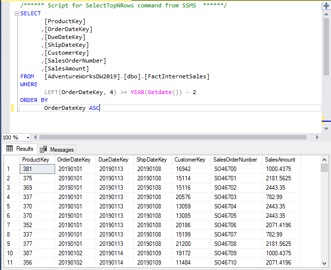
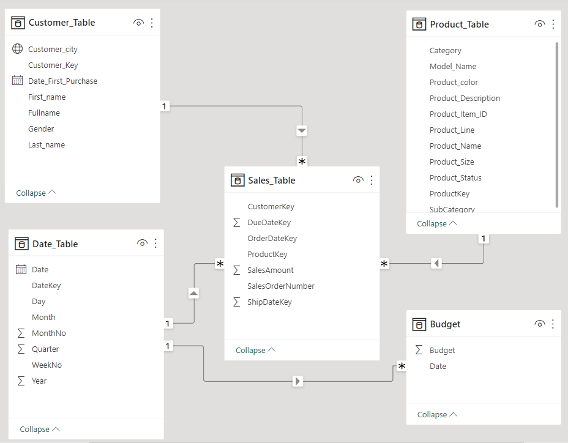
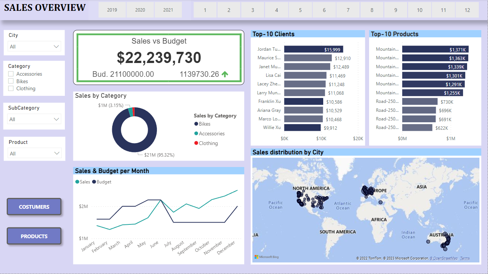

# Sales Management Project *(SQL, Power BI)*
## Skills applied
*SQL, Data visualization, Data modeling, Data transformation, Data processing, Reporting*
## Project overview
- This project explores different business metrics and how they can be displayed graphically to follow them.
- I explore the relation between sales, budget, costumers and products.
- We can obtain conclusions that will help us to make better marketing campaigns and improve profits.
- The tools used are **SQL and Power BI.**
- You can see the raw data in this **[LINK.](https://github.com/subhojitdas859/Sales_Management/tree/main/Tables)**
## Objectives
- The goal is to build a sales report that shows summarized information about the business´s current situation to understand how to make more profits. 
- The most important indicators are sales, budget, top customers, and top products.

**Deliverables:**

| Demanding | Value | Deliverable |
| ----------- | ----------- | ----------|
| A dashboard that summarizes the internet sales current situation | To understand which products and customers have the biggest impact on the company | A dashboard that shows the most important metrics and that can be updated everyday |
| An overview of sales organized by clients | To acknowledge which customers, buy more and how to sell more to them | A dashboard that can filter customers by product, city, and relevance  |
| A detailed overview of the best products | To follow those products that have better sales | A dashboard that can filter products by customer, city, and relevance |

## Data transformation and data preparation
- The data was taken from the Microsoft sample data and was extracted using SQL server into csv files to use them in the Power BI dashboard.
- Date_table was used to retrieve dates about the performances of the sales through time
- Sales_table, product_table and customer_table show information about sales, products and customers in that order
- You can see all the SQL queries by clicking **[HERE](https://github.com/subhojitdas859/Sales_Management/tree/main/Query)**.

## Data model
You can see in this image the data model used in Power BI after the data was extracted.

## Visualizations 
The final product is a 3 pages dashboard. The first one tell us a general perspective about the sales performance while other two focus in customers and products.
You can see the sales dashboard in the below image or you can also download the dashboard by clicking **[HERE](https://github.com/subhojitdas859/Sales_Management/blob/main/Tables/Sales_DB.pbix)**.

## Conclusions
- The hero product is the Mountain-200 Black but all color are also selling well in the market.
- The best clients are Jordan Turner, Maurice Shan, Janet Munoz, and Lisa Cai.
- During July, September, and November 2020 the sales were less than Budget.
